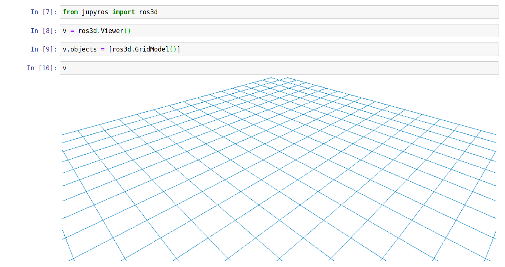
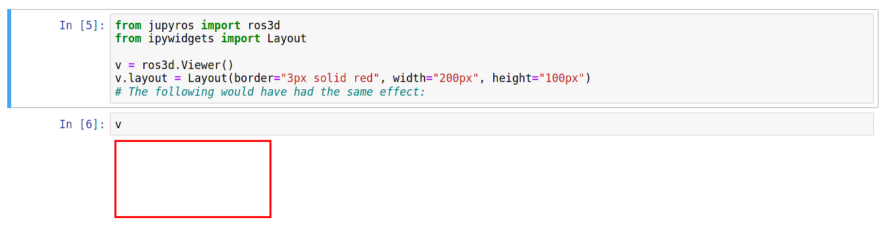

ROS 3D Widgets
==============

In order to visualize robots in the Jupyter notebook, jupyter-ros ships with the
ros3d widgets.
Jupyter widgets (`ipywidgets <https://ipywidgets.readthedocs.io/en/latest/examples/Widget%20List.html>`_)
allow for communication between the Python "Kernel" and the JavaScript frontend.

For jupyter-ros, we have utilized the powerful `ROS3D.js <https://github.com/RobotWebTools/ros3djs>`_ library to create widgets for the jupyter notebook
frontend. That means that it's easily possible to create some robot viewers
inside the notebook!

.. code-block:: py

  from jupyros import ros3d

  v = ros3d.Viewer()
  v.objects = [ros3d.GridModel()]
  v

ROS3D communicates with ROS via websocket. This communication is configured 
through the jupyter widgets protocol, but you are also required to run the
"rosbridge websocket" package in your ROS environment (or launch file).

For this, you need to make sure that you have ``ros-noetic-rosbridge-suite``
and ``ros-noetic-tf2-webrepublisher``.

Then you can run the following launch file to start up the necessary servers:

.. code-block:: xml

  <launch>
    <include file="$(find rosbridge_server)/launch/rosbridge_websocket.launch" />
    <node pkg="tf2_web_republisher" type="tf2_web_republisher" name="tf2_web_republisher" />
  </launch>

.. warning::

  The currently shipped rosbridge suite uses a very old version of the Tornado
  web server. This version is *incompatible* with the more recent version used 
  by Jupyter. If you run both (Jupyter and rosbridge) from the same Python
  environment, it is likely to silently fail (no connection from the ROS 3D
  widgets to the rosbridge).

  Therefore we recommend to separate the two environments by using conda, and a 
  generated ROS kernel.

Once the rosbridge websocket is running, we can configure a ROS connection in
the Jupyter notebook, and subscribe to a topic. For example, in order to
subscribe to a laser scan we can use the following code:

.. code-block:: python

  from jupyros import ros3d
  
  v = ros3d.Viewer()
  rc = ros3d.ROSConnection(url="ws://localhost:9090")
  tf_client = ros3d.TFClient(ros=rc, fixed_frame='')

  laser_view = ros3d.LaserScan(topic="/scan", ros=rc, tf_client=tf_client)
  g = ros3d.GridModel()
  v.objects = [g, laser_view]

  v

This will now attempt to connect to the websocket at ``ws://localhost:9090``
(which should be the address given to the rosbridge). And if successful, it
should receive data from ``/scan`` topic and display it in the 3D viewer.

Note that, similar to RViz, you can select a fixed frame, which will appear at
the origin of the viewer.

Besides the laser scan view, you can add many other visualizations to the
viewer. ROS3D contains classes for a Robot (``URDFModel``), occupancy grid
(``OccupancyGrid``), regular and interactive markers (``Marker`` and
``InteractiveMarker``), ``Pose``, ``Polygon``, ``PoseArray``, ``Path``, and
``PointCloud``.

If you want to visually change how your Viewer looks, you can use the layout
attribute (this works the same way `across many of the ipywidgets <https://ipywidgets.readthedocs.io/en/latest/examples/Widget%20Styling.html>`_).

.. code-block:: python

  from jupyros import ros3d
  from ipywidgets import Layout

  v = ros3d.Viewer()
  v.layout = Layout(border="3px solid red", width="200px", height="50px")
  # The following would have had the same effect:
  # v.layout.border = "3px solid red" ...

