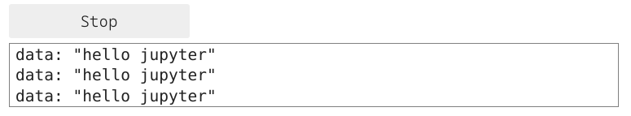
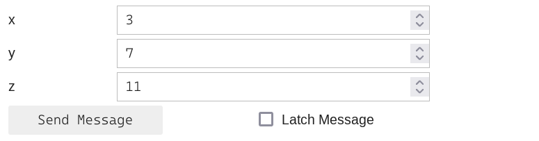
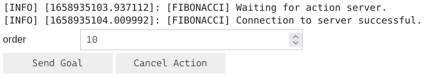
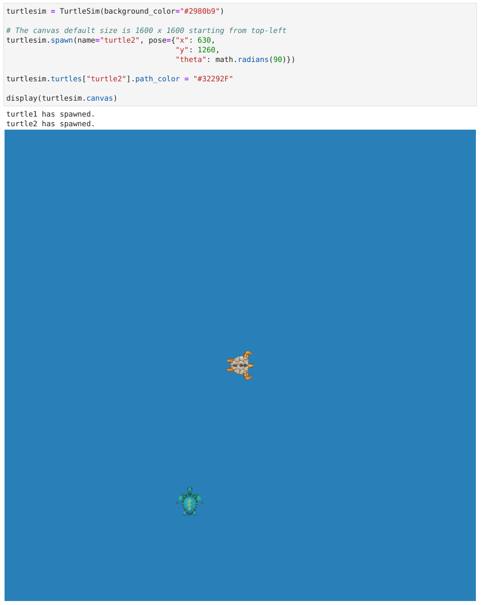

ROS Essentials
==============

Subscribing to a ROS topic
--------------------------

The Jupyter-ROS tools help publish and receive messages in a Jupyter notebook.

For publishing, the package contains tools to automatically generate widgets 
from message definitions. For receiving, the jupyter-ros package contains a
helper that redirects output to a specific output widget (instead of spamming
the entire notebook).

.. code-block:: python

  import jupyros as jr
  import rospy
  from std_msgs.msg import String

  rospy.init_node('jupyter_node')
  jr.subscribe('/sometopic', String, lambda msg: print(msg))

This creates a output widget, and buttons to toggle (stop or start) receiving
messages. Internally, jupyter-ros will save a handle to the subscriber thread.
Note that we did not use the rospy-way of creating a subscriber, but delegated
this to the jupyter-ros package.

If we now send a message from a JupyterLab terminal, we see message being
printed to the output widget below the cell where we executed the
`jr.subscribe`.

.. code-block:: shell

  $ rostopic pub /sometopic std_msgs/String "data: 'hello jupyter'" -r 10

Publishing to a ROS topic
-------------------------

In the same way we can publish to a ROS topic by using the `jr.publish` helper.

.. code-block:: python

  import jupyros as jr
  import rospy
  from std_msgs.msg import String

  rospy.init_node('jupyter_node')
  jr.publish('/sometopic', String)

This results in a jupyter widget where one can insert the desired message in
the text field. The form fields (jupyter widgets) are generated automatically
from the message definition. If a different message type is used, different
fields will be generated. For example, a ``Vector3`` message type contains
three float fields (x,y, and z) for which we will get three ``FloatTextField``
instances; these can only hold float values (and not text).

.. code-block:: python

   from geometry_msgs.msg import Vector3
   
   jr.publish('/vectortopic', Vector3)

Calling a ROS service
---------------------

The same principles of publishing and receiving messages are applied for
calling ROS services from a Jupyter notebook. Assuming that the service for
adding two integers is available, a service client widget can be created with
the following:

.. code-block:: python
   
   import jupyros
   import rospy
   from rospy_tutorials.srv import AddTwoInts

   rospy.init_node('service_node')
   jupyros.service_client('service_name', AddTwoInts)

The generated widget will change depending on the message type being passed.

.. image:: _static/images/service_client.png
   :width: 400

Calling a ROS action server
---------------------------

A widget can also be created to call ROS action servers.

.. code-block:: python

   import jupyros
   import rospy
   from actionlib_tutorials.msg import FibonacciAction, FibonacciGoal

   rospy.init_node('action_node')

As an example, the Fibonacci server can be initialized from a JupyterLab
terminal.

.. code-block:: sh

   $ rosrun actionlib_tutorials fibonacci_server.py

The widget for the server called ``'fibonacci'`` can then be generated as follows:

.. code-block:: python

   jupyros.action_client('fibonacci', FibonacciAction, FibonacciGoal, callbacks={})

The fields for the widget depend on the definition for the action *goal*.

Turtlesim
---------

A widget for the most popular *turtlesim* animation is also included in
Jupyter-ROS. The widget can be displayed with the code below, showing the
default parameters.

.. code-block:: python

   import jupyros
   import rospy
   from jupyros import TurtleSim

   turtlesim = TurtleSim(width=1600, 
                         height=1600, 
                         turtle_size=100, 
                         background_color="#4556FF")

   display(turtlesim.canvas)

When initialized, the widget will display a single turtle in the center of the canvas. The turtle images are randomized, so different turtles will appear after each run. Multiple turtles can also be spawned on the same canvas given a desired position (within the canvas limits) and orientation.

.. code-block:: python
   
   turtlesim.spawn(name="turtle2", pose={"x": 630,
                                         "y": 1260,
                                         "theta": math.radians(90)})

The turtles can be moved around by subscribing to topics such as `/turtle1/pose` to receive new *Pose* messages.

.. code-block:: python

   # Retrieve current poses of the two turtles
   new_poses = {"turtle1": turtlesim.turtles["turtle1"].pose,
                "turtle2": turtlesim.turtles["turtle2"].pose}

   # Change the pose for the second turtle
   new_poses["turtle2"] = {"x": 800, "y": 300, "theta": 2.5}

   # Update the canvas
   turtlesim.move_turtles(new_poses)